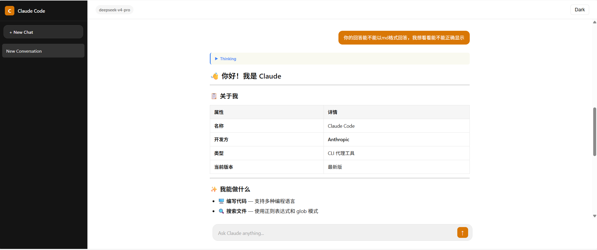

# Claude Code Web

一个完全复刻 [claude.ai](https://claude.ai) 界面风格的本地 Web 聊天客户端，通过 DeepSeek API 代理连接到 Claude Code，完整展示 Thinking 过程、工具调用等中间结果。



## 功能特性

- 🎨 **1:1 复刻 claude.ai 界面** — 侧边栏、对话列表、明暗主题、完整的 Markdown 渲染
- 🧠 **完整中间过程展示** — 与终端版 Claude Code 体验一致，展示 Thinking 块（含耗时）、工具调用、工具结果
- 🔧 **8 个内置工具** — Read、Write、Edit、Bash、Glob、Grep、WebSearch、WebFetch
- 📝 **Markdown + 数学公式** — 基于 marked.js + KaTeX，代码块语法高亮 (highlight.js)
- 💾 **对话持久化** — 自动保存/加载对话历史
- 🌓 **明暗主题切换** — 一键切换，偏好自动保存
- 📱 **响应式设计** — 移动端适配
- ⏱ **独立 Thinking 块** — 每次 API 调用生成独立 Thinking 块，带耗时标签
- 📋 **代码块一键复制** — 每个代码块右上角 Copy 按钮

## 系统要求

- [Node.js](https://nodejs.org/) >= 18
- [Claude Code](https://claude.ai/code) (用于自动读取 API 配置)

## 快速开始

```bash
# 1. 克隆仓库
git clone https://github.com/Trister718/claude-code-web.git
cd claude-code-web

# 2. 安装依赖
npm install

# 3. 同步 Claude Code 的 API 配置
npm run setup

# 4. 启动服务
npm start
```

然后在浏览器打开 `http://localhost:3000`。

## 配置说明

项目通过 `setup.js` 自动从 Claude Code 的配置文件（`~/.claude/settings.json`）读取 API 密钥和模型信息，生成 `.env` 文件。

你也可以手动创建 `.env` 文件：

```env
ANTHROPIC_AUTH_TOKEN=your-api-key
ANTHROPIC_BASE_URL=https://api.deepseek.com/anthropic
ANTHROPIC_MODEL=deepseek-v4-pro
PORT=3000
```

| 环境变量 | 说明 | 默认值 |
|---------|------|-------|
| `ANTHROPIC_AUTH_TOKEN` | API 密钥 | - |
| `ANTHROPIC_BASE_URL` | Anthropic API 地址 | `https://api.anthropic.com` |
| `ANTHROPIC_MODEL` | 模型名称 | `claude-sonnet-4-6` |
| `PORT` | 本地服务端口 | `3000` |

## 项目结构

```
claude-code-web/
├── src/
│   ├── agent.js      # Agent Loop 引擎 (流式 API 调用 + 工具执行)
│   ├── server.js     # Express 服务器 + SSE 端点
│   ├── tools.js      # 8 个工具的定义和执行器
│   └── setup.js      # 从 Claude Code 同步配置
├── public/
│   └── index.html    # 前端界面 (单页应用)
├── docs/
│   └── 方案书.md      # 架构设计文档
├── data/             # 对话数据存储 (gitignored)
├── package.json
└── .gitignore
```

## 技术架构

```
浏览器 (SSE Client) ←── SSE 流 ──→ Express Server ──→ Agent Loop ──→ Anthropic API
                                        │                    │
                                        └── 对话 CRUD ──────┘

                        SSE 事件类型:
                        • agent_start / agent_done
                        • thinking_delta / thinking_done
                        • tool_call / tool_result
                        • text_delta / text_done
                        • agent_error
```

### Agent Loop 工作流程

```
用户发送消息
    │
    ▼
┌──────────────────────────────────────────┐
│  while (未完成) {                         │
│    1. 流式调用 Anthropic API              │
│    2. 解析 SSE 事件，实时推送到前端          │
│    3. 如果有 tool_use → 执行工具 → 继续循环  │
│    4. 如果无工具调用 → 结束                 │
│  }                                       │
└──────────────────────────────────────────┘
```

## 工具列表

| 工具 | 功能 |
|-----|------|
| **Read** | 读取文件内容 |
| **Write** | 写入文件 |
| **Edit** | 精确字符串替换 |
| **Bash** | 执行 Shell 命令 |
| **Glob** | 文件名模式匹配 |
| **Grep** | 文件内容正则搜索 |
| **WebSearch** | 网络搜索 (本地模式不可用) |
| **WebFetch** | 获取网页内容 (本地模式不可用) |

## License

MIT
